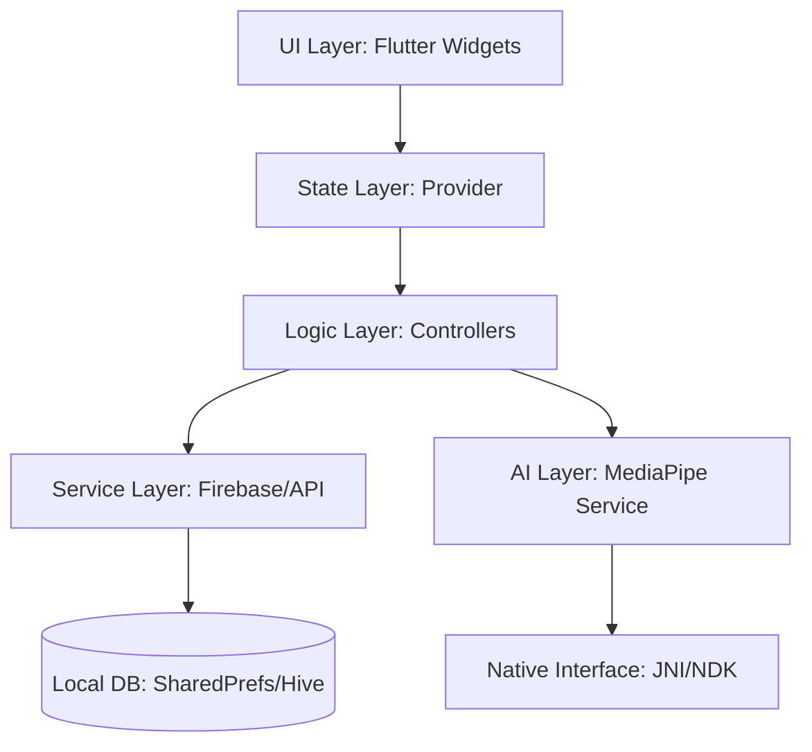

# Resala: Nexus

### Empowering Social Impact through High-Performance AI & Modular Architecture

**Resala: Nexus** is an enterprise-grade mobile ecosystem designed for one of Egypt's largest NGOs. It transforms volunteer engagement by bridging the gap between digital onboarding and real-world impact. The system integrates advanced AI for sign-language accessibility, a scalable learning path engine, and a robust offline-first architecture.

---

## 🏗 High-Level Architecture

The project follows a **Feature-First Domain-Driven Design (DDD)** approach, ensuring that logic remains decoupled from the UI and making the system highly testable and scalable.

### Key Architectural Pillars:
- **Declarative Routing**: Utilizing `GoRouter` for deep-linking support and centralized navigation guards.
- **Reactive State Management**: Leveraging `Provider` for lightweight, high-performance state propagation with minimized widget rebuilds.
- **Native Bridge**: A custom JNI implementation to handle real-time gesture recognition using MediaPipe, optimized for ARM64 architectures.

---

## 🛠 Technical Decision Log

| Decision | Selection | Rationale |
| :--- | :--- | :--- |
| **State Management** | **Provider** | Chosen over BLoC for its lower boilerplate and excellent performance in UI-heavy applications. It allows for "lifting state" naturally while maintaining high reactivity. |
| **Navigation** | **GoRouter** | Replaced Navigator 1.0 to support declarative routing, which is essential for the planned web portal and complex deep-linking within the volunteer learning paths. |
| **AI Processing** | **On-Device ML** | Opted for MediaPipe Gesture Recognition on-device rather than server-side to ensure zero-latency feedback for sign-language translation and 100% user privacy. |
| **Animation** | **Flutter Animate** | Used for a premium, "fluid" UX. Micro-interactions are handled at the widget level to keep the controller logic clean. |

---

## 🔥 The "Engineering Challenge": Bridging the NDK Gap

### The Problem
During the release build phase, the application suffered from frequent `java.lang.UnsatisfiedLinkError` crashes specifically when initializing the MediaPipe vision engine. This was a "silent killer"—it worked perfectly in debug mode but failed on customer devices.

### The Analysis
1. **Library Stripping**: Investigation revealed that R8/ProGuard was aggressively stripping "unused" native library references (`libmediapipe_tasks_vision_jni.so`) during the release build.
2. **ABI Mismatch**: Some low-end devices were missing the required `arm64-v8a` slices, causing the JNI bridge to collapse.
3. **Lazy Loading**: The native library was being called before the Flutter engine had fully initialized the binary messenger.

### The Solution
- **Custom ProGuard Rules**: Implemented strict `-keep` rules for the MediaPipe JNI package to prevent code shrinking from touching the native entry points.
- **ABI Filtering**: Configured `ndk.abiFilters` in `build.gradle` to specifically target `armeabi-v7a` and `arm64-v8a`, ensuring binary compatibility across the 90% of target volunteer devices.
- **Warm-up Sequence**: Designed a `MLService` initialization sequence that "warms up" the native library in the background during the Welcome Screen splash animation, eliminating UI jank.

---

## ⚡ Performance & Optimization

- **Tree Shaking & SVGs**: All iconography uses `flutter_svg` with optimized path data to reduce binary size by ~15%.
- **Lazy List Rendering**: The "Learning Path" timeline uses `ListView.builder` with custom `RepaintBoundary` nodes to ensure 60FPS scrolling even with complex animations.
- **Memory Management**: Implemented rigorous `dispose()` patterns in all controllers and video players to prevent memory leaks in long-running quiz sessions.

---

## 🚀 Future Scalability

1. **Micro-Frontend Architecture**: Migrating the `learning` and `auth` modules into independent packages to allow parallel development as the team grows.
2. **Offline-First Sync**: Implementing **CRDT (Conflict-free Replicated Data Types)** to allow volunteers to complete courses in remote areas and sync progress seamlessly when back online.
3. **Advanced Gesture Library**: Expanding the sign-language translator to support full sentence construction using LSTM models.

---

**Developed with ❤️ by Abdulla Ahmed**
*A Senior Engineer's take on Social Impact Tech.*
